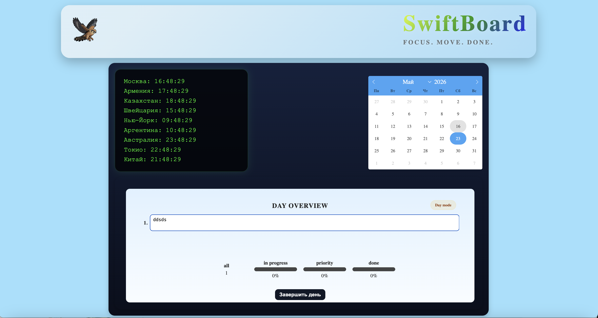
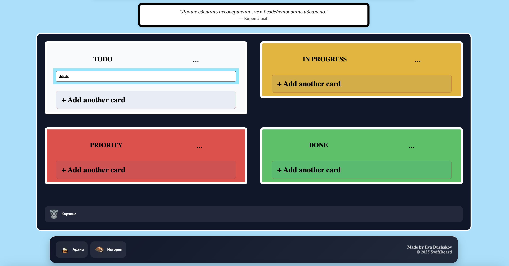
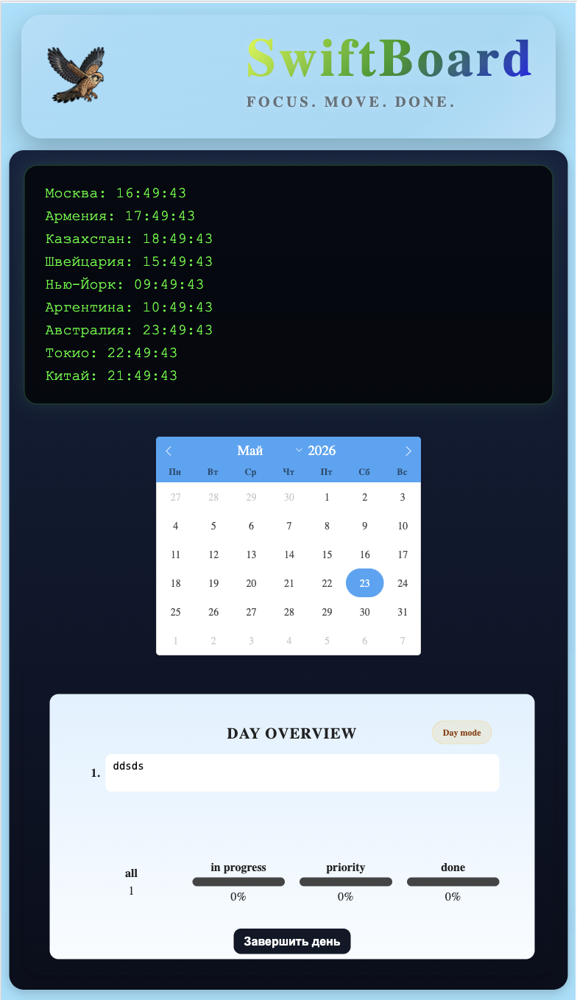
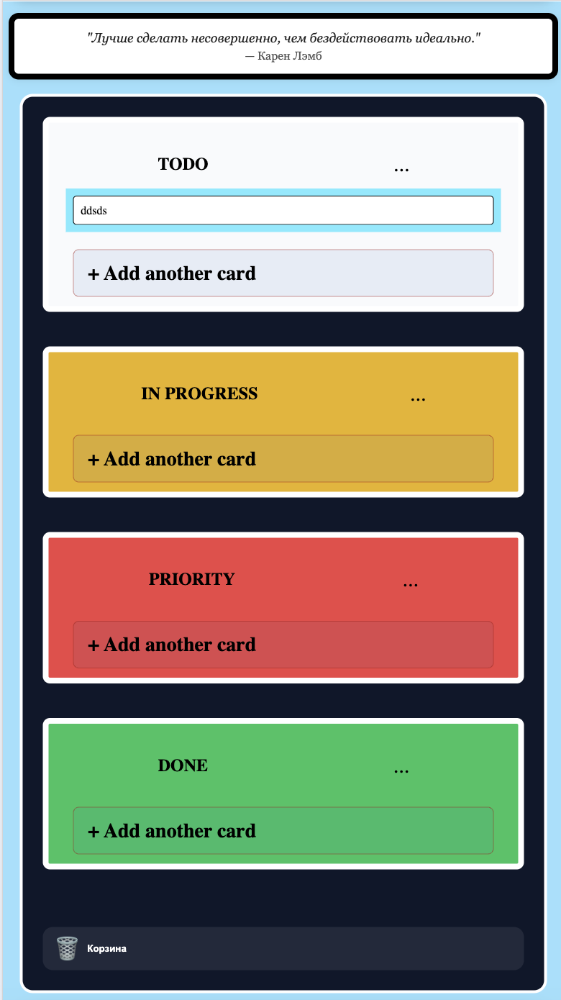
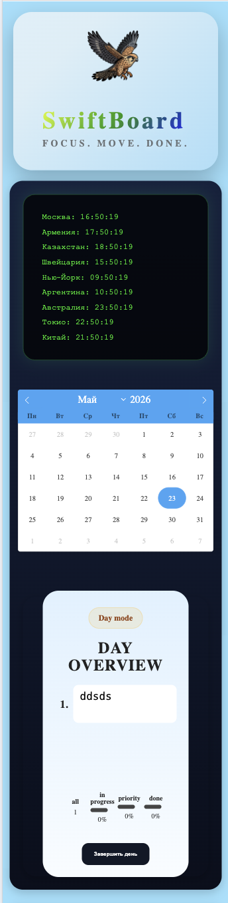
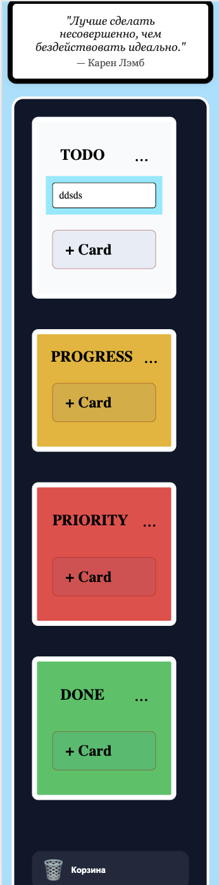

https://ilyaduzhakov.github.io/DnD/

## Run the Project

npm run start

# SwiftBoard

SwiftBoard is a visual task planner inspired by Trello that helps users track tasks, manage priorities, and monitor daily progress.

The project was created as a full drag-and-drop task board with a responsive interface for desktop, tablet, and mobile devices.

---

## Main Features

- Create tasks
- Move tasks between columns
- Status system:
  - TODO
  - IN PROGRESS
  - PRIORITY
  - DONE
- DAY OVERVIEW with daily statistics
- Progress indicators
- Completed tasks archive
- Task history
- Calendar
- Time zones
- Daily quote
- Trash zone for deleting tasks
- Data saving with LocalStorage
- Responsive layout

## Technologies

- JavaScript
- HTML
- CSS
- Webpack
- Drag and Drop API
- LocalStorage
- Flatpickr

---

# Desktop Version

---

# Tablet Version

---

# Mobile Version

---

SwiftBoard continues to evolve and improve.

Planned features and future updates:

- Progressive Web App (PWA)
- Notifications and reminders
- Theme customization
- Authorization system
- Cloud synchronization
- File attachments
- Achievements and motivation system
- Advanced statistics and analytics
- Improved mobile experience
- Performance optimization
- UI/UX improvements

The project is actively being developed and new features will be added over time.

Author

Made by Ilya Duzhakov

2025